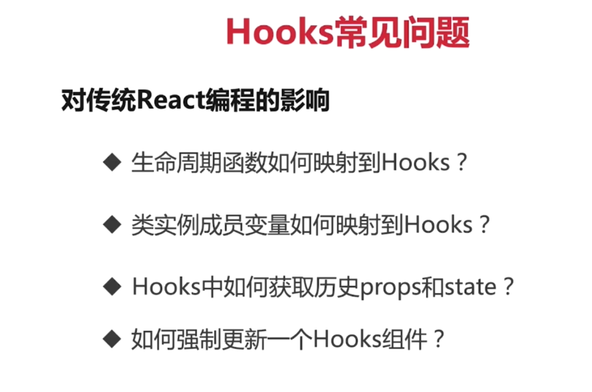

# react 新特性

## Context ContextType 
#  lazy import Suspense 。fallback
# memo pureComponent 他俩是如何判断传入的值是否相等的？

## Context 

pureComponent 提供简单的算法，俩避免无数据更新时，组件不重新渲染，在无状态组件中（无this），可以用memo来代替purecomponent  =====》 只能监听对象的第一层。无法进行深度监听

## hooks
以往组件用class 来编写，只有无状态组件可以用函数编写
现在可以在函数组件中使用特定义状态，支持几乎所有组件用函数组件编写。
没有类组件和函数组件之分，都可以有状态了。 
解决组件间复用问题，以前类组件不支持多继承。 渲染属性和高阶组件导致层级冗余。相关逻辑分散。
this指向困扰

解决：
函数组件无this 问题
自定义hooks 方便状态复用
副作用的关注点分离

usestate 按照第一次运行的顺序来返回运行结果，不要搞混了。 按照稳定的顺序和数量运行。 多调用和少调用都不行
useeffect 在组件每次渲染之后调用 第一次相当于 componentdidmount 后面的调用相当于 componentUpdate
装饰器的写法 处在提案期。
useEffect 毁掉函数触发的时机： 组件重新渲染，组件卸载。useeffect 第二个参数，是个可选的数组，数组每一项都不变化的情况下才会阻止effect执行 不穿都执行，穿空数组第一次执行。数组不变的形式。

context 的不同用法的优缺点。不同使用方法。？

memo 和usememo 仅仅做性能优化之用。

useMmmo 是在渲染期间完成的。
useMemo 返回的函数等价于 useCallback  解决了传入子组件的函数过度变化，导致过度渲染的问题。

useref
获取子组件或dom节点句柄。
渲染周期之间共享数据的存储 (下一次渲染访问上一次渲染的数据)
### 自定义hooks use开头 和函数组件的区别就是输入输出的区别 hook可以返回jsx
hooks 调用法则： 在顶层组件和自定义hooks中调用，不能再循环 条件语句或嵌套函数中调用。

# hooks的常见问题

<!-- [百度一下](www.baidu.com) -->
<!-- |测试|第一行|
|----| ----|
|小明| 二|
|    |空| -->

# redux

## service Worker 的生命周期时间。pwa中不可获缺的一部分。

fetch api cache api notification
